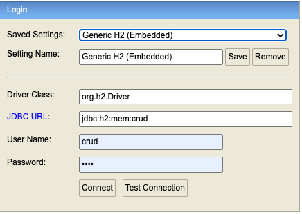
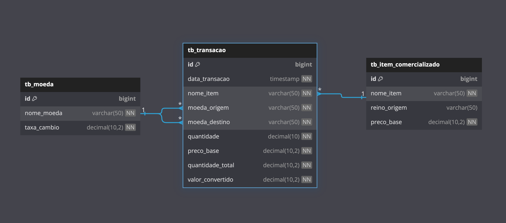

# Sistema de Conversão de Moedas entre Ouro Real e Tibar

## Descrição do Projeto

Este projeto é um sistema de conversão de moedas desenvolvido para atender às necessidades dos mercadores da cidade de Wefin, no reino de SRM. Com a chegada de anãos comerciantes que utilizam a moeda Tibar, surgiu a necessidade de um sistema que permita a conversão eficiente entre Ouro Real e Tibar, garantindo que as negociações continuem fluindo sem entraves.

O sistema oferece:

- **Mapeamento e atualização de taxas de câmbio**: Permite que as taxas entre Ouro Real e Tibar sejam atualizadas conforme a demanda do mercado.
- **Conversão personalizada por produto**: Implementa fórmulas de conversão específicas para cada tipo de produto, considerando sua natureza e reino de origem.
- **Persistência resiliente**: Garante que todas as transações sejam registradas de forma segura, evitando perdas em caso de falhas.
- **API interativa e documentada**: Fornece endpoints para consulta de taxas, realização de trocas e acesso a históricos detalhados.
- **Consultas avançadas**: Oferece filtros para buscas por moeda, reino, data da taxa e tipo de transação.

## Tecnologias Utilizadas

- **Linguagem**: Java 17
- **Framework**: Spring Boot, Spring Validation, Spring MVC, Spring Data JPA
- **Banco de Dados**: H2
- **ORM**: Spring Data JPA (Hibernate)
- **Liquibase**: Migrações de base de dados
- **Documentação da API**: Springdoc OpenAPI (Swagger UI)
- **MapStruct**: Biblioteca de mapeamento de objetos Java
- **Controle de Dependências**: Maven
- **Testes**: JUnit 5, Mockito

## Como Executar o Projeto

### Pré-requisitos

- **Docker** instalado.

### Passos para Execução

1. **Clonar o Repositório**

   ```bash
   git clone [https://github.com/laerciothleal/code-challenge-srm.git](https://github.com/laerciothleal/code-challenge-srm.git)
   cd code-challenge-srm
   ```
   
2. **Construir e Executar a Aplicação**

   Utilize o seguinte arquivo `docker-compose.yml`:

   ```yaml
   services:
     backend:
       build:
         dockerfile: ./Dockerfile
       ports:
         - "8080:8080"
       volumes:
         - .m2:/root/.m2
       stdin_open: true
       tty: true
   ```

   - **Comandos para subir o ambiente**:
     ```bash
     docker-compose up --build
     ```
3. **Executar teste**
`mvn clean test`

4. **Acessar a Documentação da API**

   - Swagger: `http://localhost:8080/swagger-ui.html`

5. **Acessar o Banco de Dados**

   h2 console `http://localhost:8080/h2/login.jsp`

   Credencias:
      - JDBC URL:  jdbc:h2:mem:crud
     - User Name: crud
     - Password:  crud



6. **Script SQL**

- Se encontra nesse caminho dentro do projeto: `src/main/resources/db/changelog/changes/001-initial_script.sql`
  
- **DER**:
  


## Contato

- **Desenvolvedor**: Laercio Leal
- **LinkedIn**: https://www.linkedin.com/in/laercioth/

